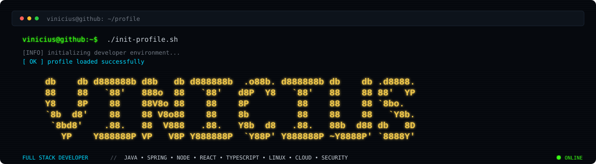

<div align="center">



<br><br>


<br>


</div>

<br>

```console
┌──(vinicius㉿github)-[~]
└─$ whoami
```

```text
Full Stack Developer

Building web applications, APIs, integrations and infrastructure.

Currently exploring:
Linux • Networking • Cybersecurity • Pentest • Containers • Cloud
```

<br>

## `> ./load-stack.sh`

### `01 // languages`

<p>
  
</p>

### `02 // frontend`

<p>
  
</p>

### `03 // backend`

<p>
  
</p>

### `04 // infrastructure`

<p>
  
</p>

### `05 // database`

<p>
  
</p>

### `06 // tools`

<p>
  
</p>

<br>

---

## `> ./security-lab --status`

```text
╭──────────────────────────────────────────────────────────────────╮
│                                                                  │
│    SECURITY LAB                                        ONLINE    │
│                                                                  │
├──────────────────────────────────────────────────────────────────┤
│                                                                  │
│    Linux                    [██████████████████]     ACTIVE       │
│    Networking               [████████████████░░]     ACTIVE       │
│    Web Security             [██████████████░░░░]     LEARNING     │
│    Network Analysis         [████████████░░░░░░]     LEARNING     │
│    Vulnerability Analysis   [██████████░░░░░░░░]     LEARNING     │
│    Penetration Testing      [████████░░░░░░░░░░]     LEARNING     │
│                                                                  │
╰──────────────────────────────────────────────────────────────────╯
```

<br>

<p>
  
  
  
  
  
</p>

<br>

---

## `> ./github --analytics`

<div align="center">


</div>

<br>

<div align="center">


</div>

<br>

---

## `> git activity --watch`

<div align="center">


</div>

<br>

---

## `> cat stack.yml`

```yaml
identity:
  user: vinicius
  role: Full Stack Developer

development:
  frontend:
    - React
    - Next.js
    - TypeScript
    - JavaScript

  backend:
    - Java
    - Spring Boot
    - Node.js

database:
  - PostgreSQL
  - SQLite

infrastructure:
  - Linux
  - Docker
  - Bash
  - AWS
  - GCP
  - Git

security:
  studying:
    - Networking
    - Web Security
    - Vulnerability Analysis
    - Penetration Testing

  tools:
    - Nmap
    - Wireshark
    - Burp Suite
    - Metasploit
    - Splunk
```

<br>

---

<div align="center">

```console
vinicius@github:~$ echo $CURRENT_MISSION

BUILD SOMETHING.
BREAK SOMETHING.
UNDERSTAND WHY.
BUILD IT BETTER.
```

<br>


</div>
